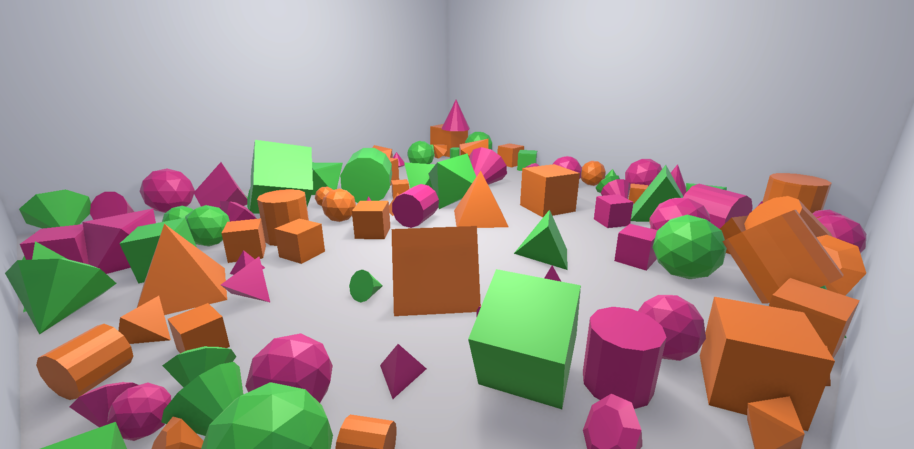
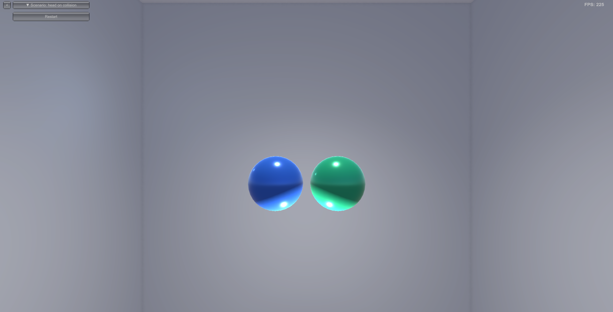
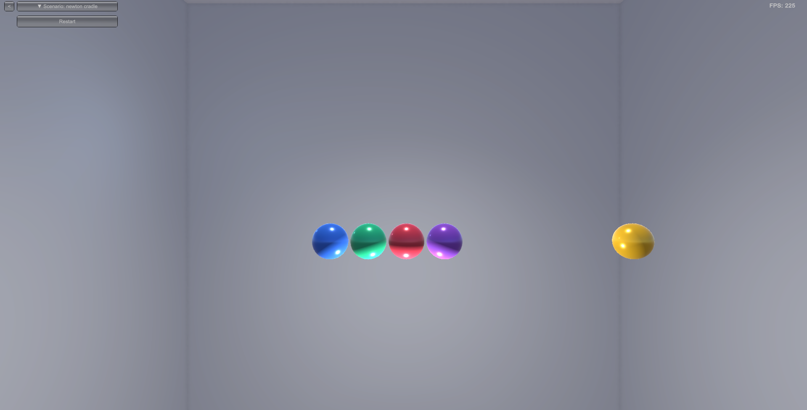
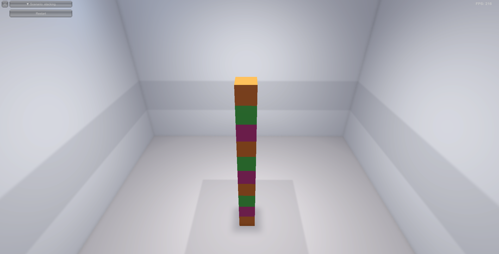
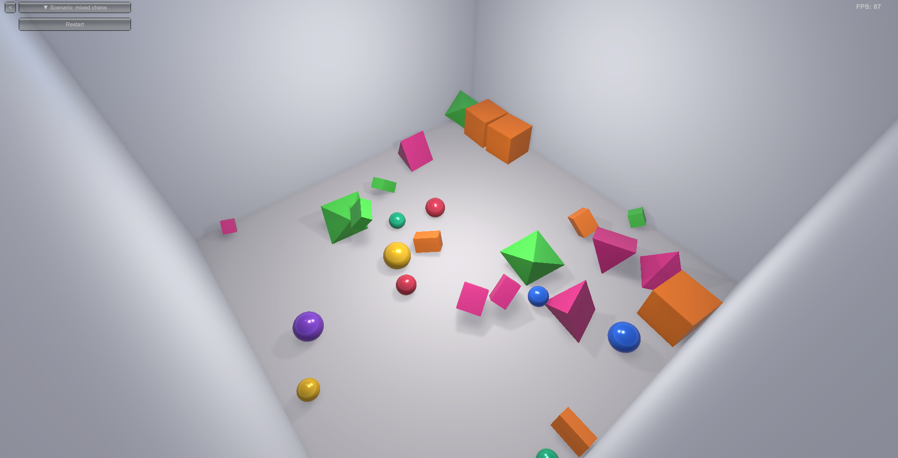
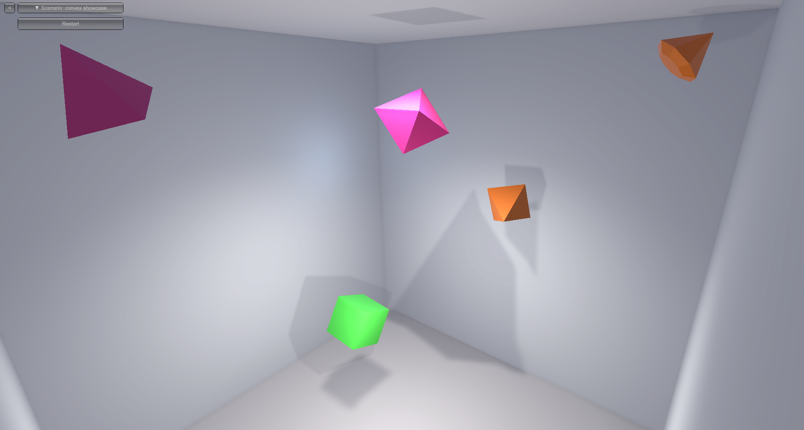
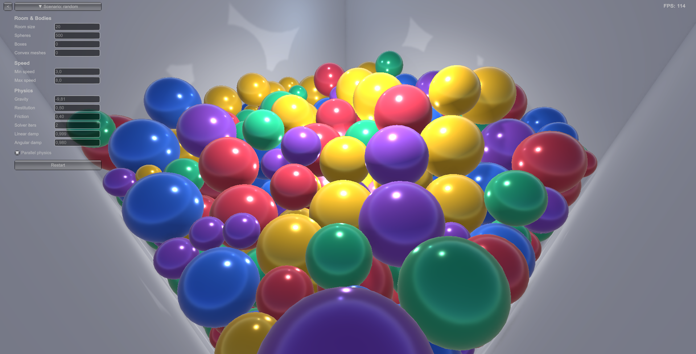

# 3D Rigid Body Physics Engine

A from-scratch 3D rigid body physics engine written in C#, with a Unity-based real-time visualizer and a standalone benchmark suite. The engine supports spheres, boxes, and arbitrary convex meshes loaded from OBJ files, with GJK+EPA collision detection and multiple parallelisation strategies.

---

## Demo



---

## Architecture

The solution is split into three independent projects:

| Project | Type | Purpose |
|---|---|---|
| `PhysicsEngine` | .NET class library | Core simulation — shapes, rigid bodies, collision, integration |
| `UnityVisualization` | Unity 6 project | Real-time 3D rendering with scenario selector UI |
| `PhysicsBenchmark` | .NET console app | Scenario generation, physics verification, and performance benchmarks |

```
CourseWork/
├── PhysicsEngine/          # Core library
│   └── PhysicsEngine/
│       ├── Core/           # RigidBody, IShape, SphereShape, BoxShape, ConvexMeshShape
│       ├── Collision/      # GjkEpa, CollisionDetector, CollisionResolver, ContactPoint
│       ├── Dynamics/       # PhysicsWorld, Integrator, ParallelStrategy
│       └── Serialization/  # ScenarioBuilder, ScenarioSerializer, ObjLoader
├── UnityVisualization/     # Unity project
│   └── Assets/Scripts/     # SimulationRunner, BodyVisualizer, ScenarioSelector, FreeCameraController
├── PhysicsBenchmark/       # Benchmark console app
│   ├── BenchmarkRunner.cs
│   ├── ScenarioGenerator.cs
│   └── VerificationRunner.cs
└── Models/                 # OBJ mesh assets
```

---

## Features

### Physics Engine

- **Collision shapes** — sphere, axis-aligned box, convex mesh (loaded from OBJ)
- **GJK + EPA** — exact convex-convex narrow phase with contact point and penetration depth
- **Impulse-based resolution** — restitution, friction, angular response with full inertia tensor
- **Sleep system** — bodies supported by the contact graph are put to sleep when kinetic energy falls below threshold; awoken on collision
- **Parallel broad/narrow phase** — four strategies selectable at runtime:

| Strategy | API |
|---|---|
| `Sequential` | single-threaded baseline |
| `ParallelFor` | `Parallel.For` with configurable thread count |
| `TaskBased` | manual `Task.Run` partitioning |
| `ThreadPool` | `ThreadPool.QueueUserWorkItem` partitioning |

### Unity Visualizer

- Loads JSON scenarios from `StreamingAssets/Scenarios/` at runtime
- Scenario selector UI and free-look camera included
- URP rendering with per-body random colours
- Live FPS counter

### Benchmark Suite

- Generates six reproducible JSON scenarios
- Physics verification tests (energy conservation, momentum conservation, no penetration)
- Three benchmark series exported to CSV

---

## Scenarios

| Scenario | Description |
|---|---|
| `wall_bounce` | 7 bodies bouncing inside a box |
| `head_on_collision` | Two spheres on a direct collision course |
| `newton_cradle` | 5-ball Newton's cradle |
| `stacking` | Tower of boxes — tests sleep system |
| `mixed_chaos` | 36 mixed-shape free-fall |
| `convex_showcase` | Convex mesh polyhedra |

### Head-on collision


### Newton's cradle


### Stacking


### Mixed chaos


### Convex mesh showcase


---

## Performance

Benchmarks run on an 8-core CPU, 20 measured runs (+1 warmup), 500 simulation steps per run. All bodies are convex mesh tetrahedra.

### 500-sphere stress test (Unity)


### Series 1 — Body count scaling (8 threads, `Parallel.For`)

| Bodies | Sequential (ms) | Parallel (ms) | Speedup |
|---:|---:|---:|---:|
| 50 | 165 | 135 | 1.23× |
| 100 | 523 | 322 | 1.63× |
| 200 | 1 771 | 910 | 1.95× |
| 400 | 6 618 | 3 026 | 2.19× |
| 800 | 23 893 | 10 576 | 2.26× |
| 1 500 | 80 689 | 36 108 | 2.23× |
| 2 500 | 219 874 | 99 711 | 2.21× |

### Series 2 — Thread count impact (1 000 bodies, `Parallel.For`)

| Threads | Sequential (ms) | Parallel (ms) | Speedup |
|---:|---:|---:|---:|
| 2 | 36 773 | 23 616 | 1.56× |
| 4 | 36 773 | 17 561 | 2.09× |
| 6 | 36 773 | 16 985 | 2.16× |
| **8** | **36 773** | **16 901** | **2.18×** |
| 12 | 36 773 | 18 058 | 2.04× |
| 16 | 36 773 | 19 255 | 1.91× |

Peak throughput at 8 threads (physical core count). Hyperthreading adds overhead beyond that.

### Series 3 — Strategy comparison (1 000 bodies, 8 threads)

| Strategy | Time (ms) | Speedup |
|---|---:|---:|
| Sequential | 36 827 | 1.00× |
| `Parallel.For` | 16 497 | 2.23× |
| `Task.Run` | 18 462 | 1.99× |
| `ThreadPool` | 18 433 | 2.00× |

`Parallel.For` leads due to its built-in work-stealing scheduler with lower overhead than manual task partitioning.

---

## Getting Started

### Prerequisites

- .NET 8 SDK
- Unity 6 (for visualizer)

### Run the benchmark suite

```bash
cd PhysicsBenchmark
dotnet run
# Choose option 7 to generate scenarios, verify, and run all benchmarks
```

Results are written to `PhysicsBenchmark/results/`.

### Open the Unity visualizer

1. Open `UnityVisualization/` in Unity Hub (Unity 6+).
2. Open the main scene and press Play.
3. Use the scenario selector panel to load a scenario, then press **Simulate**.
4. Hold right-click and use WASD to fly the camera.

### Use the library

```csharp
var world = new PhysicsWorld
{
    Gravity = new Vector3(0, -9.81f, 0),
    Restitution = 0.8f,
    Friction = 0.4f
};

world.AddBody(new RigidBody(new SphereShape(0.5f), mass: 1f, position: new Vector3(0, 5, 0)));
world.AddBody(new RigidBody(new BoxShape(new Vector3(10, 0.5f, 10)), mass: 0f, position: Vector3.Zero, isStatic: true));

for (var i = 0; i < 1000; i++)
    world.Simulate(dt: 0.016f, ParallelStrategy.ParallelFor, threadCount: 8);
```
